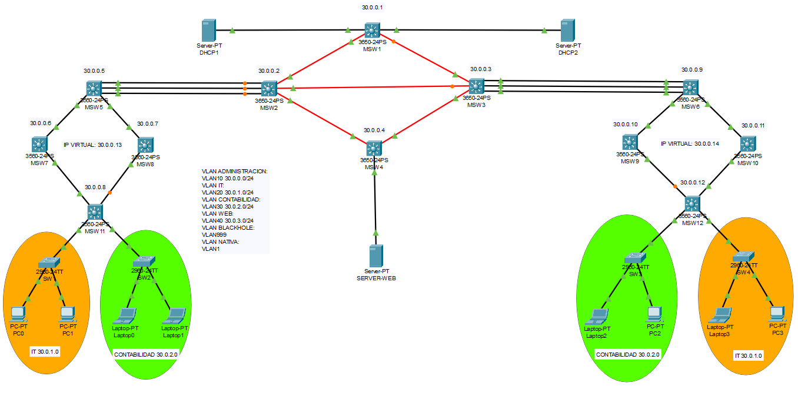
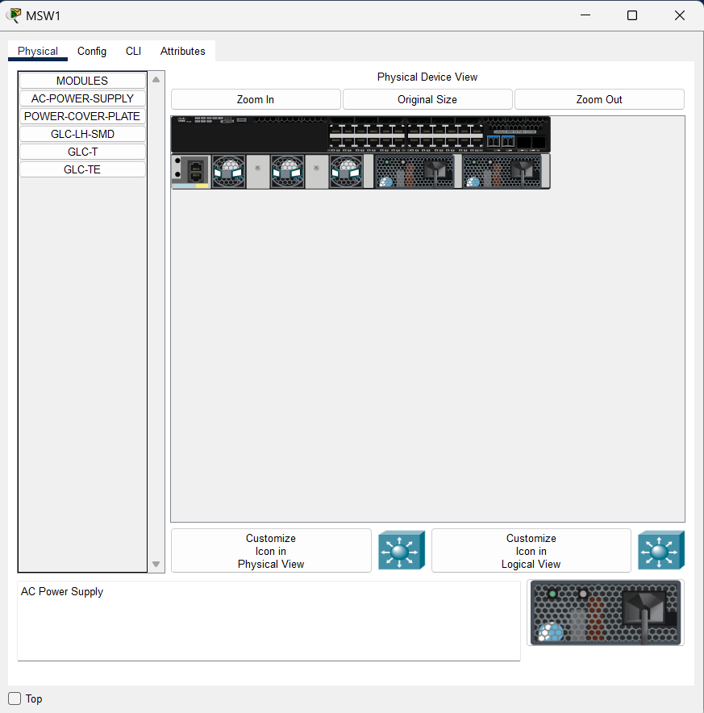
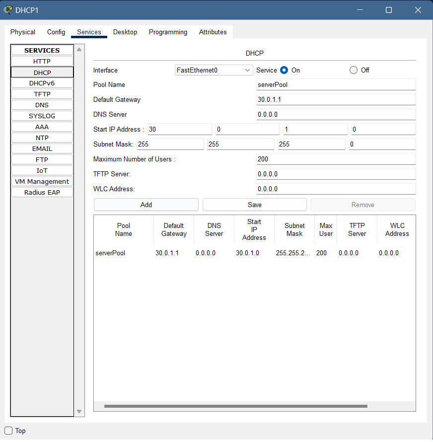
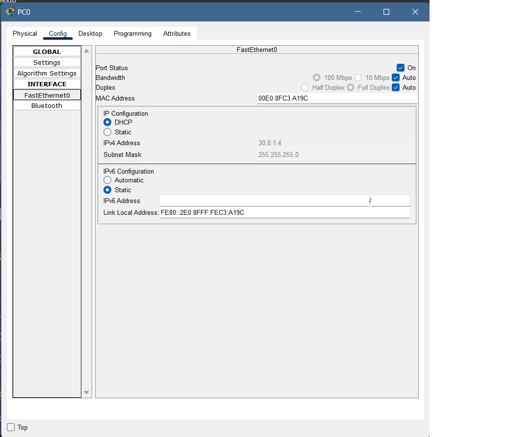
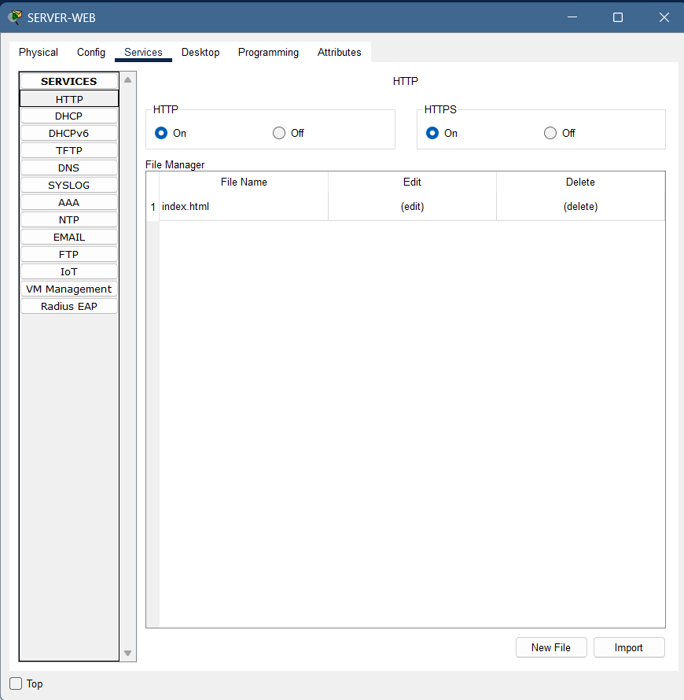
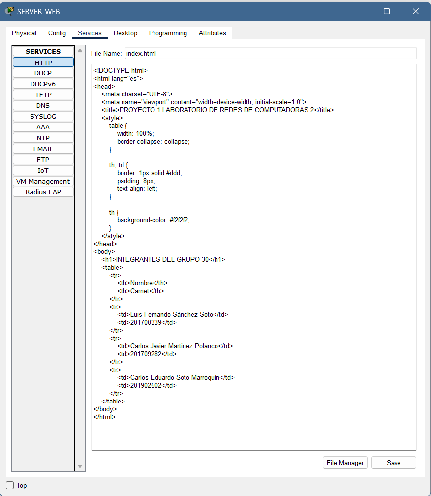

# Manual técnico | Proyecto 1 

## Integrantes Grupo 30

| Carnet    | Nombre                         |
| --------- | ------------------------------ |
| 201700339 | Luis Fernando Sánchez Soto     |
| 201902502 | Carlos Eduardo Soto Marroquin  |
| 201709282 | Carlos Javier Martínez Polanco |

### Topología implementada

<p align="justify">Para llevar a cabo la configuración de la topología requerida, se empleó la aplicación Packet Tracer, la cual incluyó la disposición de 8 switches 3560, 4 switches 3650 y 4 switches 2960 de capa 2, junto con la integración de 4 PC-PT y 4 Laptop-PT. Cada switch fue configurado meticulosamente con sus correspondientes puertos troncales y de acceso, tal como se explicará en detalle posteriormente.</p>



<p align="justify">Para habilitar la conexión entre los switches 3650 mediante cable de fibra óptica, se llevó a cabo la configuración para añadir puertos y un módulo de fuente de alimentación a los 4 switches centrales de la topología:</p>



<p align="justify">Configuración Server DHCP:</p>



<p align="justify">Configuración PC DHCP:</p>



<p align="justify">Configuración Server WEB con servicio HHTP:</p>





## Configuración de IP

| Dispositivo   | Dirección IP    | Máscara de subred |
|---------------|-----------------|-------------------|
| MSW1          | 30.0.0.1        | 255.255.255.0     |
| MSW7 (HSRP)   | 30.0.0.13       | 255.255.255.0     |
| MSW7 (Física) | 30.0.0.6        | 255.255.255.0     |
| MSW8 (HSRP)   | 30.0.0.13       | 255.255.255.0     |
| MSW8 (Física) | 30.0.0.7        | 255.255.255.0     |
| MSW9 (HSRP)   | 30.0.0.14       | 255.255.255.0     |
| MSW9 (Física) | 30.0.0.10       | 255.255.255.0     |
| MSW10 (HSRP)  | 30.0.0.14       | 255.255.255.0     |
| MSW10 (Física)| 30.0.0.11       | 255.255.255.0     |
| MSW11         | 30.0.0.8        | 255.255.255.0     |
| MSW12         | 30.0.0.12       | 255.255.255.0     |
| SW1           | 30.0.0.2        | 255.255.255.0     |
| DHCP1         | 30.0.1.2        | 255.255.255.0     |
| DHCP2         | 30.0.1.3        | 255.255.255.0     |
| WEB           | 30.0.3.2        | 255.255.255.0     |


## Configuración de puertos
<p align="justify">En esta sección, se llevaron a cabo ajustes en los puertos de cada switch. En términos generales, se configuraron específicamente aquellos que están conectados directamente a dispositivos como PC-PT, Laptop-PT, los 2 servidores DHCP y el servidor Web en modo acceso. Por otro lado, se establecieron los demás puertos en modo trunked para garantizar una comunicación adecuada en toda la topología. A continuación, se presentan algunos ejemplos de las configuraciones realizadas para una mejor comprensión.</p>

## VLAN

Iniciando esta configuración se tomó como base las VLAN's solicitadas, como se muestra a continuación en la tabla:

| Nombre          | Número | Descripción                                                |
|-----------------|--------|------------------------------------------------------------|
| ADMINISTRACION  | 10     | VLAN para la administración de la red               |
| IT              | 20     | VLAN para el departamento de Tecnología de la Información  |
| CONTABILIDAD    | 30     | VLAN para el departamento de Contabilidad                  |
| WEB             | 40     | VLAN para servidores web                                   |
| BLACKHOLE       | 999    | VLAN de descarte de tráfico no deseado                     |
| HSRP            | -      | Direcciones IP virtuales HSRP en switches                  |
| Servidores      | -      | Direcciones IP estáticas de los servidores                 |


## LACP (PortChannel)

<p align="justify">
Se realizó la configuración del PortChannel, donde es una técnica que se utiliza para combinar múltiples enlaces físicos en un solo enlace lógico de alta velocidad. Esto mejora la capacidad y la redundancia de la conexión entre dos dispositivos, como un switch y un servidor o entre dos switches.</p>

## DHCP

<p align="justify">
Se realizó la configuración del protocolo DHCP en los 2 switches DHCP1 y DHCP2, donde se les ingresó las ip de forma estática, en conjunto con su respectivo gateway, DNS.</p>


## Configuraciones de MSW's

#### Configuracion MSW1

```bash
enable
configure terminal 
hostname MSW1
vtp domain p1g30
vtp password proyecto
vtp version 2
vtp mode server
vlan 10
name ADMINISTRACION
vlan 20
name IT
vlan 30
name CONTABILIDAD
vlan 40
name WEB
vlan 999
name BLACKHOLE
no ip domain-lookup
enable secret proyecto
line console 0
password proyecto
login
interface g1/0/1
switchport mode access
switchport access vlan 20
no shutdown
interface g1/0/2
switchport mode access
switchport access vlan 30
no shutdown
interface range g1/0/3-24
switchport mode access 
switchport access vlan 999
shutdown
interface range g1/1/3-4
switchport mode access 
switchport access vlan 999
shutdown
interface range g1/1/1-2
switchport mode trunk
switchport trunk allowed vlan all
no shutdown
interface vlan 10
ip address 30.0.0.1 255.255.255.0
no shutdown
interface vlan 20
ip address 30.0.1.1 255.255.255.0
no shutdown
interface vlan 30
ip address 30.0.2.1 255.255.255.0
no shutdown
exit
service password-encryption
banner motd $ SOLO PERSONAL AUTORIZADO! $
ip routing
router eigrp 30
network 30.0.0.0
network 30.0.1.0
network 30.0.2.0
network 30.0.3.0
auto-summary
end
copy running-config startup-config
```

#### Configuracion MSW2

```bash
enable
configure terminal 
hostname MSW2
vtp domain p1g30
vtp password proyecto
vtp version 2
vtp mode client
no ip domain-lookup
enable secret proyecto
line console 0
password proyecto
login
interface range g1/1/1-3
switchport mode trunk
switchport trunk allowed vlan all
no shutdown
interface range g1/0/1-3
channel-group 1 mode active
no shutdown
interface Port-channel1
switchport mode trunk
switchport trunk allowed vlan all
no shutdown
interface range g1/0/4-24
switchport mode access 
switchport access vlan 999
shutdown
interface g1/1/4
switchport mode access 
switchport access vlan 999
shutdown
interface vlan 10
ip address 30.0.0.2 255.255.255.0
no shutdown
service password-encryption
banner motd $ SOLO PERSONAL AUTORIZADO! $
ip routing
router eigrp 30
network 30.0.0.0
network 30.0.1.0
network 30.0.2.0
network 30.0.3.0
auto-summary
end
copy running-config startup-config
```

#### Configuracion MSW3

```bash
enable
configure terminal 
hostname MSW3
vtp domain p1g30
vtp password proyecto
vtp version 2
vtp mode client
no ip domain-lookup
enable secret proyecto
line console 0
password proyecto
login
interface range g1/1/1-3
switchport mode trunk
switchport trunk allowed vlan all
no shutdown
interface range g1/0/1-3
channel-group 1 mode active
no shutdown
interface Port-channel1
switchport mode trunk
switchport trunk allowed vlan all
no shutdown
interface range g1/0/4-24
switchport mode access 
switchport access vlan 999
shutdown
interface g1/1/4
switchport mode access 
switchport access vlan 999
shutdown
interface vlan 10
ip address 30.0.0.3 255.255.255.0
no shutdown
exit
service password-encryption
banner motd $ SOLO PERSONAL AUTORIZADO! $
ip routing
router eigrp 30
network 30.0.0.0
network 30.0.1.0
network 30.0.2.0
network 30.0.3.0
auto-summary
end
copy running-config startup-config
```

#### Configuracion MSW4

```bash
enable
configure terminal 
hostname MSW4
vtp domain p1g30
vtp password proyecto
vtp version 2
vtp mode client
no ip domain-lookup
enable secret proyecto
line console 0
password proyecto
login
interface range g1/1/1-2
switchport mode trunk
switchport trunk allowed vlan all
no shutdown
interface g1/0/1
switchport mode access
switchport access vlan 40
no shutdown
interface range g1/0/2-24
switchport mode access 
switchport access vlan 999
shutdown
interface range g1/1/3-4
switchport mode access 
switchport access vlan 999
shutdown
interface vlan 10
ip address 30.0.0.4 255.255.255.0
no shutdown
interface vlan 40
ip address 30.0.3.1 255.255.255.0
no shutdown
exit
service password-encryption
banner motd $ SOLO PERSONAL AUTORIZADO! $
ip routing
router eigrp 30
network 30.0.0.0
network 30.0.1.0
network 30.0.2.0
network 30.0.3.0
auto-summary
end
copy running-config startup-config
```

#### Configuracion MSW5

```bash
enable
configure terminal 
hostname MSW5
vtp domain p1g30
vtp password proyecto
vtp version 2
vtp mode client
no ip domain-lookup
enable secret proyecto
line console 0
password proyecto
login
interface range fa0/4-5
switchport trunk encapsulation dot1q
switchport mode trunk
switchport trunk allowed vlan all
no shutdown
interface range fa0/1-3
channel-group 1 mode active
no shutdown
interface Port-channel1
switchport trunk encapsulation dot1q
switchport mode trunk
switchport trunk allowed vlan all
no shutdown
interface range fa0/6-24
switchport mode access 
switchport access vlan 999
shutdown
interface range g0/1-2
switchport mode access 
switchport access vlan 999
shutdown
interface vlan 10
ip address 30.0.0.5 255.255.255.0
no shutdown
exit
service password-encryption
banner motd $ SOLO PERSONAL AUTORIZADO! $
ip routing
router eigrp 30
network 30.0.0.0
network 30.0.1.0
network 30.0.2.0
network 30.0.3.0
auto-summary
end
copy running-config startup-config
```

#### Configuracion MSW6

```bash
enable
configure terminal 
hostname MSW6
vtp domain p1g30
vtp password proyecto
vtp version 2
vtp mode client
no ip domain-lookup
enable secret proyecto
line console 0
password proyecto
login
interface range fa0/4-5
switchport trunk encapsulation dot1q
switchport mode trunk
switchport trunk allowed vlan all
no shutdown
interface range fa0/1-3
channel-group 1 mode active
no shutdown
interface Port-channel1
switchport trunk encapsulation dot1q
switchport mode trunk
switchport trunk allowed vlan all
no shutdown
interface range fa0/6-24
switchport mode access 
switchport access vlan 999
shutdown
interface range g0/1-2
switchport mode access 
switchport access vlan 999
shutdown
interface vlan 10
ip address 30.0.0.9 255.255.255.0
no shutdown
exit
service password-encryption
banner motd $ SOLO PERSONAL AUTORIZADO! $
ip routing
router eigrp 30
network 30.0.0.0
network 30.0.1.0
network 30.0.2.0
network 30.0.3.0
auto-summary
end
copy running-config startup-config
```


#### Configuracion MSW7

```bash
enable
configure terminal 
hostname MSW7
vtp domain p1g30
vtp password proyecto
vtp version 2
vtp mode client
no ip domain-lookup
enable secret proyecto
line console 0
password proyecto
login
interface range fa0/1-2
switchport trunk encapsulation dot1q
switchport mode trunk
switchport trunk allowed vlan all
no shutdown
interface range fa0/3-24
switchport mode access 
switchport access vlan 999
shutdown
interface range g0/1-2
switchport mode access 
switchport access vlan 999
shutdown
interface vlan 10
ip address 30.0.0.6 255.255.255.0
standby 1 ip 30.0.0.13
standby 1 priority 110
standby 1 preempt
no shutdown
exit
service password-encryption
banner motd $ SOLO PERSONAL AUTORIZADO! $
ip routing
router eigrp 30
network 30.0.0.0
network 30.0.1.0
network 30.0.2.0
network 30.0.3.0
auto-summary
end
copy running-config startup-config
```

#### Configuracion MSW8

```bash
enable
configure terminal 
hostname MSW8
vtp domain p1g30
vtp password proyecto
vtp version 2
vtp mode client
no ip domain-lookup
enable secret proyecto
line console 0
password proyecto
login
interface range fa0/1-2
switchport trunk encapsulation dot1q
switchport mode trunk
switchport trunk allowed vlan all
no shutdown
interface range fa0/3-24
switchport mode access 
switchport access vlan 999
shutdown
interface range g0/1-2
switchport mode access 
switchport access vlan 999
shutdown
interface vlan 10
ip address 30.0.0.7 255.255.255.0
standby 1 ip 30.0.0.13
standby 1 preempt
no shutdown
exit
service password-encryption
banner motd $ SOLO PERSONAL AUTORIZADO! $
ip routing
router eigrp 30
network 30.0.0.0
network 30.0.1.0
network 30.0.2.0
network 30.0.3.0
auto-summary
end
copy running-config startup-config
```

#### Configuracion MSW9

```bash
enable
configure terminal 
hostname MSW9
vtp domain p1g30
vtp password proyecto
vtp version 2
vtp mode client
no ip domain-lookup
enable secret proyecto
line console 0
password proyecto
login
interface range fa0/1-2
switchport trunk encapsulation dot1q
switchport mode trunk
switchport trunk allowed vlan all
no shutdown
interface range fa0/3-24
switchport mode access 
switchport access vlan 999
shutdown
interface range g0/1-2
switchport mode access 
switchport access vlan 999
shutdown
interface vlan 10
ip address 30.0.0.10 255.255.255.0
standby 2 ip 30.0.0.14
standby 2 priority 120
standby 2 preempt
no shutdown
exit
service password-encryption
banner motd $ SOLO PERSONAL AUTORIZADO! $
ip routing
router eigrp 30
network 30.0.0.0
network 30.0.1.0
network 30.0.2.0
network 30.0.3.0
auto-summary
end
copy running-config startup-config
```

#### Configuracion MSW10

```bash
enable
configure terminal 
hostname MSW10
vtp domain p1g30
vtp password proyecto
vtp version 2
vtp mode client
no ip domain-lookup
enable secret proyecto
line console 0
password proyecto
login
interface range fa0/1-2
switchport trunk encapsulation dot1q
switchport mode trunk
switchport trunk allowed vlan all
no shutdown
interface range fa0/3-24
switchport mode access 
switchport access vlan 999
shutdown
interface range g0/1-2
switchport mode access 
switchport access vlan 999
shutdown
interface vlan 10
ip address 30.0.0.11 255.255.255.0
standby 2 ip 30.0.0.14
standby 2 preempt
no shutdown
exit
service password-encryption
banner motd $ SOLO PERSONAL AUTORIZADO! $
ip routing
router eigrp 30
network 30.0.0.0
network 30.0.1.0
network 30.0.2.0
network 30.0.3.0
auto-summary
end
copy running-config startup-config
```

#### Configuracion MSW11

```bash
enable
configure terminal 
hostname MSW11
vtp domain p1g30
vtp password proyecto
vtp version 2
vtp mode client
no ip domain-lookup
enable secret proyecto
line console 0
password proyecto
login
interface range fa0/1-2
switchport trunk encapsulation dot1q
switchport mode trunk
switchport trunk allowed vlan all
no shutdown
interface fa0/3
switchport trunk encapsulation dot1q
switchport mode trunk
switchport trunk allowed vlan 1,20,40,1002-1005
no shutdown
interface fa0/4
switchport trunk encapsulation dot1q
switchport mode trunk
switchport trunk allowed vlan 1,30,40,1002-1005
no shutdown
interface range fa0/5-24
switchport mode access 
switchport access vlan 999
shutdown
interface range g0/1-2
switchport mode access 
switchport access vlan 999
shutdown
interface vlan 10
ip address 30.0.0.8 255.255.255.0
no shutdown
interface vlan 20
ip address 30.0.1.1 255.255.255.0
no shutdown
interface vlan 30
ip address 30.0.2.1 255.255.255.0
no shutdown
interface vlan 40
ip address 30.0.3.1 255.255.255.0
no shutdown
exit
service password-encryption
banner motd $ SOLO PERSONAL AUTORIZADO! $
ip routing
router eigrp 30
network 30.0.0.0
network 30.0.1.0
network 30.0.2.0
network 30.0.3.0
auto-summary
end
copy running-config startup-config
```

#### Configuracion MSW12

```bash
enable
configure terminal 
hostname MSW12
vtp domain p1g30
vtp password proyecto
vtp version 2
vtp mode client
no ip domain-lookup
enable secret proyecto
line console 0
password proyecto
login
interface range fa0/1-2
switchport trunk encapsulation dot1q
switchport mode trunk
switchport trunk allowed vlan all
no shutdown
interface fa0/3
switchport trunk encapsulation dot1q
switchport mode trunk
switchport trunk allowed vlan 1,30,40,1002-1005
no shutdown
interface fa0/4
switchport trunk encapsulation dot1q
switchport mode trunk
switchport trunk allowed vlan 1,20,40,1002-1005
no shutdown
interface range fa0/5-24
switchport mode access 
switchport access vlan 999
shutdown
interface range g0/1-2
switchport mode access 
switchport access vlan 999
shutdown
interface vlan 10
ip address 30.0.0.12 255.255.255.0
no shutdown
interface vlan 20
ip address 30.0.1.1 255.255.255.0
no shutdown
interface vlan 30
ip address 30.0.2.1 255.255.255.0
no shutdown
interface vlan 40
ip address 30.0.3.1 255.255.255.0
no shutdown
exit
service password-encryption
banner motd $ SOLO PERSONAL AUTORIZADO! $
ip routing
router eigrp 30
network 30.0.0.0
network 30.0.1.0
network 30.0.2.0
network 30.0.3.0
auto-summary
end
copy running-config startup-config
```

## Configuraciones de SW's

#### Configuracion SW1

```bash
enable
configure terminal 
hostname SW1
vtp domain p1g30
vtp password proyecto
vtp version 2
vtp mode client
no ip domain-lookup
enable secret proyecto
line console 0
password proyecto
login
interface fa0/1
switchport mode trunk
switchport trunk allowed vlan all
no shutdown
interface range fa0/2-3
switchport mode access
switchport access vlan 20
no shutdown
interface range fa0/4-24
switchport mode access 
switchport access vlan 999
shutdown
interface range g0/1-2
switchport mode access 
switchport access vlan 999
shutdown
exit
service password-encryption
banner motd $ SOLO PERSONAL AUTORIZADO! $
end
copy running-config startup-config
```


#### Configuracion SW2

```bash
enable
configure terminal 
hostname SW2
vtp domain p1g30
vtp password proyecto
vtp version 2
vtp mode client
no ip domain-lookup
enable secret proyecto
line console 0
password proyecto
login
interface fa0/1
switchport mode trunk
switchport trunk allowed vlan all
no shutdown
interface range fa0/2-3
switchport mode access
switchport access vlan 30
no shutdown
interface range fa0/4-24
switchport mode access 
switchport access vlan 999
shutdown
interface range g0/1-2
switchport mode access 
switchport access vlan 999
shutdown
exit
service password-encryption
banner motd $ SOLO PERSONAL AUTORIZADO! $
end
copy running-config startup-config
```

#### Configuracion SW3

```bash
enable
configure terminal 
hostname SW3
vtp domain p1g30
vtp password proyecto
vtp version 2
vtp mode client
no ip domain-lookup
enable secret proyecto
line console 0
password proyecto
login
interface fa0/1
switchport mode trunk
switchport trunk allowed vlan all
no shutdown
interface range fa0/2-3
switchport mode access
switchport access vlan 30
no shutdown
interface range fa0/4-24
switchport mode access 
switchport access vlan 999
shutdown
interface range g0/1-2
switchport mode access 
switchport access vlan 999
shutdown
exit
service password-encryption
banner motd $ SOLO PERSONAL AUTORIZADO! $
end
copy running-config startup-config
```

#### Configuracion SW4

```bash
enable
configure terminal 
hostname SW4
vtp domain p1g30
vtp password proyecto
vtp version 2
vtp mode client
no ip domain-lookup
enable secret proyecto
line console 0
password proyecto
login
interface fa0/1
switchport mode trunk
switchport trunk allowed vlan all
no shutdown
interface range fa0/2-3
switchport mode access
switchport access vlan 20
no shutdown
interface range fa0/4-24
switchport mode access 
switchport access vlan 999
shutdown
interface range g0/1-2
switchport mode access 
switchport access vlan 999
shutdown
exit
service password-encryption
banner motd $ SOLO PERSONAL AUTORIZADO! $
end
copy running-config startup-config
```

###### _2024 - Laboratorio de Redes de computadoras 2_

---
